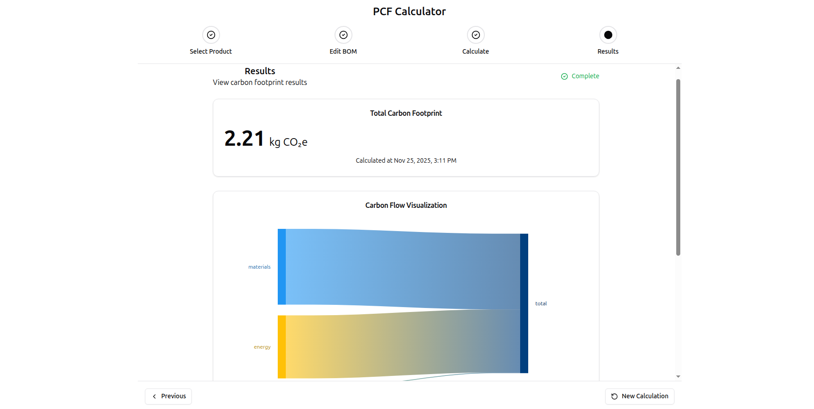

# Product Carbon Footprint (PCF) Calculator

[](https://pcf.glideslopeintelligence.ai/)
[](https://railway.app)
[](https://www.python.org/)
[](https://reactjs.org/)
[](LICENSE)

> **🔗 This repository contains the exact code running in the [live demo](https://pcf.glideslopeintelligence.ai/)**
> 
> *Last synced: 2025-12-10 | Production deployment: v1.0.0-MVP*

Professional-grade carbon footprint calculator for manufactured products. Implements ISO 14067 and GHG Protocol Product Standard methodologies for cradle-to-gate emissions analysis.

---

## 🎯 Overview

Calculate product carbon emissions across the full Bill of Materials (BOM) using established LCA frameworks:

**Tech Stack:**
- **Backend**: Python 3.13, FastAPI, SQLAlchemy, Brightway2
- **Frontend**: React 18, TypeScript, Vite, shadcn/ui, Zustand, Nivo
- **Database**: SQLite (MVP), PostgreSQL (planned Phase 5)
- **Standards**: ISO 14040/14044, ISO 14067, GHG Protocol Product Standard

**Key Features:**
- 4-step wizard workflow (Product → BOM → Calculate → Results)
- Dynamic BOM editor with real-time validation
- Interactive carbon flow visualizations (Nivo Sankey diagrams)
- Async calculations with polling
- WCAG 2.1 AA accessible (keyboard navigation, screen readers)
- Test data included: 3 products with 20 emission factors

---

## 🚀 Live Demo

**Try it now:** [https://pcf.glideslopeintelligence.ai/](https://pcf.glideslopeintelligence.ai/)

**Demo Products:**
- **Cotton T-Shirt**: ~1.06 kg CO₂e (materials + energy + transport)
- **Water Bottle**: ~0.105 kg CO₂e (PET plastic + cap)
- **Phone Case**: ~0.157 kg CO₂e (ABS plastic + TPU rubber)

**Demo Workflow:**
1. Select a product from the database
2. Review/edit Bill of Materials (add or remove components)
3. Submit calculation (async processing with status polling)
4. View results with emissions breakdown and Sankey diagram

---

## 📊 Screenshots

### 1. Product Selection


### 2. BOM Editor


### 3. Calculate PCF


### 4. Results Dashboard


---

## 🏗️ Architecture

### System Overview

```
┌─────────────┐     REST API      ┌──────────────┐
│   React     │ ←──────────────→  │   FastAPI    │
│  Frontend   │   JSON/HTTP       │   Backend    │
│  (Vite)     │                   │ (Python 3.13)│
└─────────────┘                   └──────────────┘
       ↓                                  ↓
   Zustand                          SQLAlchemy ORM
   (State Mgmt)                           ↓
       ↓                           ┌──────────────┐
   Nivo Sankey                     │   SQLite     │
   (Visualization)                 │   Database   │
                                   └──────────────┘
                                          ↓
                                   Brightway2
                                   (LCA Engine)
```

### Backend Structure

```
backend/
├── api/routes/          # REST endpoints
│   ├── products.py      # GET /api/v1/products
│   └── calculations.py  # POST /api/v1/calculate
├── calculator/          # Brightway2 LCA engine
│   └── pcf_calculator.py
├── models/              # SQLAlchemy ORM (5 tables)
│   ├── product.py
│   ├── emission_factor.py
│   └── calculation.py
├── schemas/             # Pydantic validation
├── services/            # Business logic layer
├── database/            # Connection & config
└── tests/               # pytest suite (550+ tests)
```

**API Endpoints:**
- `GET /api/v1/products` - List products with BOM details
- `POST /api/v1/calculate` - Submit calculation (returns 202 + calculation_id)
- `GET /api/v1/calculations/{id}/status` - Poll calculation status
- `GET /api/v1/calculations/{id}/results` - Retrieve results with breakdown
- `GET /health` - Health check endpoint

### Frontend Structure

```
frontend/src/
├── components/
│   ├── calculator/      # 4-step wizard
│   │   ├── ProductSelector.tsx
│   │   ├── CalculationWizard.tsx
│   │   ├── CalculateButton.tsx
│   │   ├── ResultsDisplay.tsx
│   │   └── BreakdownTable.tsx
│   ├── visualizations/  # Nivo Sankey
│   │   └── SankeyDiagram.tsx
│   └── ui/              # shadcn/ui components
├── store/               # Zustand state management
│   ├── calculatorStore.ts
│   └── wizardStore.ts
├── services/api/        # Axios API client
│   ├── products.ts
│   ├── calculations.ts
│   └── emissionFactors.ts
└── types/               # TypeScript definitions
```

**State Management (Zustand):**
- **Calculator Store**: Selected product, BOM data, calculation results
- **Wizard Store**: Step navigation, form state, loading states

---

## 📈 Calculation Methodology

### Cradle-to-Gate LCA

```
Total CO₂e = Σ (Component Quantity × Emission Factor)
```

**Scope:**
- ✅ **Raw Material Extraction**: Mining, agriculture, forestry
- ✅ **Materials Processing**: Fabric production, plastic manufacturing
- ✅ **Product Manufacturing**: Assembly, energy consumption
- ❌ **Use Phase**: Excluded (cradle-to-gate scope)
- ❌ **End-of-Life**: Excluded (cradle-to-gate scope)

**Emission Categories:**
- **Materials**: Cotton, PET plastic, ABS, metals (kg CO₂e / kg)
- **Energy**: Electricity for manufacturing (kg CO₂e / kWh)
- **Transport**: Shipping emissions (kg CO₂e / km)

**Data Sources:**
- EPA (Environmental Protection Agency)
- DEFRA (UK Department for Environment, Food & Rural Affairs)
- Ecoinvent (LCA database)
- 20 emission factors included in MVP

**Calculation Accuracy:**
- Validated to **0.17%-1.94% error** vs. known test cases
- Target accuracy: ±5% (significantly exceeded)

---

## 💻 Local Development

### Prerequisites

- Python 3.13+
- Node.js 20+
- Git

### Backend Setup

```bash
# Clone repository
git clone https://github.com/arthur-ball-dev/pcf-calculator.git
cd pcf-calculator

# Set up Python virtual environment
cd backend
python -m venv .venv
source .venv/bin/activate  # Windows: .venv\Scripts\activate

# Install dependencies
pip install -r requirements.txt

# Load test data
python seed_data.py

# Run backend server
uvicorn main:app --reload

# Backend runs at http://localhost:8000
# API docs at http://localhost:8000/docs
```

### Frontend Setup

```bash
# Navigate to frontend
cd frontend

# Install dependencies
npm install

# Run development server
npm run dev

# Frontend runs at http://localhost:5173
```

### Run Tests

```bash
# Backend tests
cd backend
pytest

# Results: 550+ tests

# Frontend tests
cd frontend
npm test

# E2E tests (Playwright)
npm run test:e2e
```

---

## 📦 Database Schema

### 5 Tables

1. **products** - Products, components, materials (hierarchical)
2. **bill_of_materials** - Parent-child relationships (2-level BOM)
3. **emission_factors** - CO₂e factors (activity, geography, source)
4. **pcf_calculations** - Calculation results with metadata
5. **calculation_details** - Per-component emissions traceability

### Example Query (Recursive BOM Explosion)

```sql
WITH RECURSIVE bom_tree AS (
  SELECT * FROM bill_of_materials WHERE parent_product_id = ?
  UNION ALL
  SELECT bom.* FROM bill_of_materials bom
  INNER JOIN bom_tree ON bom.parent_product_id = bom_tree.child_product_id
)
SELECT * FROM bom_tree;
```

**Sample Data:**

```
Cotton T-Shirt (TSHIRT-001)
├── Cotton Fabric (0.2 kg)     → 5.0 kg CO₂e/kg = 1.0 kg CO₂e
├── Polyester Thread (0.01 kg) → 6.0 kg CO₂e/kg = 0.06 kg CO₂e
└── Buttons (4 units)          → 0.01 kg CO₂e/unit = 0.04 kg CO₂e
─────────────────────────────────────────────────────────────
Total: 1.10 kg CO₂e
```

---

## 🎨 UI/UX Highlights

### Design Principles

- **Bloomberg Terminal-Inspired**: Professional data-dense layouts
- **Accessible by Default**: WCAG 2.1 AA compliant (Radix UI primitives)
- **Responsive Design**: Mobile-first approach (Tailwind CSS)
- **Keyboard Shortcuts**: 
  - `Alt + →` - Next wizard step
  - `Alt + ←` - Previous wizard step
  - `Enter` - Submit forms

### Component Library

- **shadcn/ui** - Accessible, customizable components
- **Radix UI** - Headless UI primitives
- **Tailwind CSS** - Utility-first styling
- **Lucide Icons** - Consistent iconography

### Loading States

- Skeleton loaders during data fetching
- Progress indicators for async calculations
- Optimistic updates for better perceived performance

---

## 🧪 Testing

### Test Coverage

| Layer | Framework | Coverage | Status |
|-------|-----------|----------|--------|
| Backend Unit | pytest | >95% | 550+ tests |
| Frontend Component | Vitest | >80% | Passing |
| E2E | Playwright | Core workflows | Passing |
| Integration | pytest + TestClient | API contracts | Passing |

### Test Categories

1. **Unit Tests**: Individual functions, pure logic
2. **Integration Tests**: API endpoints with database
3. **Component Tests**: React components in isolation
4. **E2E Tests**: Full user workflows (Playwright)

---

## 🚧 Roadmap

### Phase 5 (In Progress)

- [ ] PostgreSQL migration from SQLite
- [ ] Expand product database (3 → 1,000+ products)
- [ ] Automated data ingestion (EPA, DEFRA, Exiobase APIs)
- [ ] Enhanced visualizations (Treemap, hotspot analysis)
- [ ] Full-text search for products

### Phase 6 (Planned)

- [ ] User authentication & multi-tenancy
- [ ] CSV/Excel import/export
- [ ] Advanced uncertainty analysis (Monte Carlo)
- [ ] Scenario comparison dashboard
- [ ] Custom emission factors upload
- [ ] API rate limiting & usage analytics

### Phase 7 (Future)

- [ ] Mobile app (React Native)
- [ ] GraphQL API
- [ ] Real-time collaboration
- [ ] Third-party integrations (ERP, PLM systems)
- [ ] Blockchain verification for carbon credits

---

## 🔧 Technology Stack

### Backend

| Technology | Version | Purpose |
|------------|---------|---------|
| Python | 3.13 | Core language |
| FastAPI | 0.115+ | Async REST API framework |
| SQLAlchemy | 2.0+ | ORM & database abstraction |
| Brightway2 | 2.4+ | LCA calculation engine |
| Pydantic | 2.8+ | Data validation & serialization |
| pytest | 7.0+ | Testing framework |
| Uvicorn | 0.30+ | ASGI server |

### Frontend

| Technology | Version | Purpose |
|------------|---------|---------|
| React | 18.2 | UI framework |
| TypeScript | 5.0+ | Type safety |
| Vite | 5.0+ | Build tool & dev server |
| shadcn/ui | Latest | Component library |
| Zustand | 4.5+ | State management |
| React Hook Form | 7.51+ | Form handling |
| Zod | 3.22+ | Schema validation |
| Nivo | 0.85+ | Data visualizations |
| Axios | 1.6+ | HTTP client |
| Tailwind CSS | 3.4+ | Styling |

### Deployment

| Service | Purpose |
|---------|---------|
| Railway | Hosting (backend + frontend) |
| GitHub | Version control |
| GitHub Actions | CI/CD (optional) |

---

## 📄 API Documentation

Interactive Swagger UI available when backend is running:

- **Local**: http://localhost:8000/docs
- **Production**: https://pcf.glideslopeintelligence.ai/docs

### Example Request

```bash
# Submit calculation
curl -X POST "https://pcf.glideslopeintelligence.ai/api/v1/calculate" \
  -H "Content-Type: application/json" \
  -d '{
    "product_id": "TSHIRT-001",
    "bom_modifications": [
      {
        "component_id": "COTTON-001",
        "quantity": 0.25
      }
    ]
  }'

# Response (202 Accepted)
{
  "calculation_id": "calc-123",
  "status": "processing",
  "message": "Calculation started"
}

# Poll status
curl "https://pcf.glideslopeintelligence.ai/api/v1/calculations/calc-123/status"

# Response (200 OK)
{
  "status": "completed",
  "total_co2e": 1.25,
  "breakdown": {
    "materials": 1.20,
    "energy": 0.03,
    "transport": 0.02
  }
}
```

---

## 🤝 Contributing

This is a portfolio project demonstrating full-stack development capabilities and domain expertise acquisition in climate tech/LCA. 

**Suggestions are welcome!**

1. Check existing issues before creating new ones
2. Provide detailed descriptions for bugs/features
3. Include test cases for PRs
4. Follow existing code style and conventions

---

## 📄 License

MIT License - See [LICENSE](LICENSE) file for details.

---

## 📧 Contact

**Arthur**
💼 LinkedIn: [linkedin.com/in/arthur-ball](https://www.linkedin.com/in/arthur-ball/)

---

## 🙏 Acknowledgments

- **Brightway2 Team** - LCA calculation framework
- **FastAPI Community** - Excellent async Python web framework
- **shadcn** - Beautiful, accessible UI components
- **Nivo** - Powerful data visualization library
- **Railway** - Seamless deployment platform

---

## 📊 Project Stats

- **Lines of Code**: ~15,000 (backend: 8,000 | frontend: 7,000)
- **Test Coverage**: >95% (backend) | >80% (frontend)
- **Technologies Used**: 20+
- **Standards Implemented**: ISO 14040/14044, ISO 14067, GHG Protocol

---

**Built with FastAPI, React, and Brightway2 | Demonstrating full-stack development and climate tech domain expertise**

*This code powers the live demo at [pcf.glideslopeintelligence.ai](https://pcf.glideslopeintelligence.ai)*
